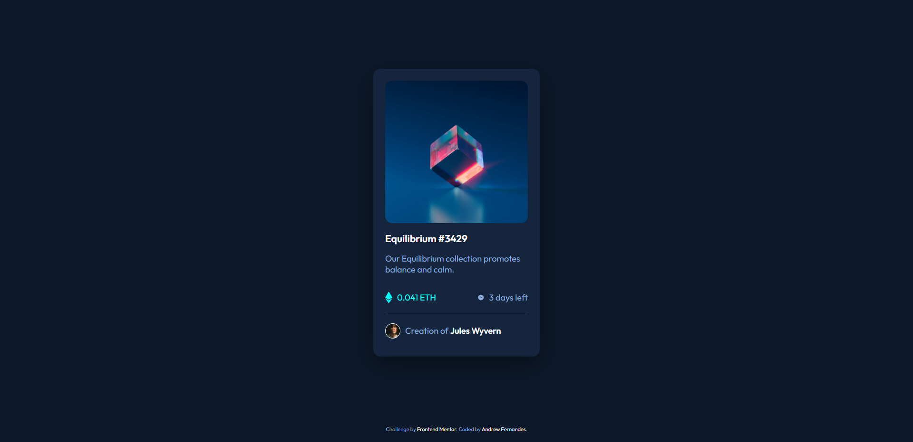

# Frontend Mentor - NFT preview card component solution

This is a solution to the [NFT preview card component challenge on Frontend Mentor](https://www.frontendmentor.io/challenges/nft-preview-card-component-SbdUL_w0U). Frontend Mentor challenges help you improve your coding skills by building realistic projects. 

## Table of contents

- [Overview](#overview)
  - [The challenge](#the-challenge)
  - [Screenshot](#screenshot)
  - [Links](#links)
- [My process](#my-process)
  - [Built with](#built-with)

## Overview

### The challenge

Users should be able to:

- View the optimal layout depending on their device's screen size
- See hover states for interactive elements

### Screenshot

### Links

- Solution URL: [https://www.frontendmentor.io/solutions/nft-preview-card-component-using-angular-neBH_kal7](https://www.frontendmentor.io/solutions/nft-preview-card-component-using-angular-neBH_kal7)
- Live Site URL: [https://nft-preview-card-component-andrew8gmf.vercel.app/](https://nft-preview-card-component-andrew8gmf.vercel.app/)

## My process

### Built with

- Semantic HTML5 markup
- CSS custom properties
- Flexbox
- Mobile-first workflow
- Sassy CSS (SCSS)
- Block Element Modifier (BEM)
- [Angular](https://angular.io/) - TS framework